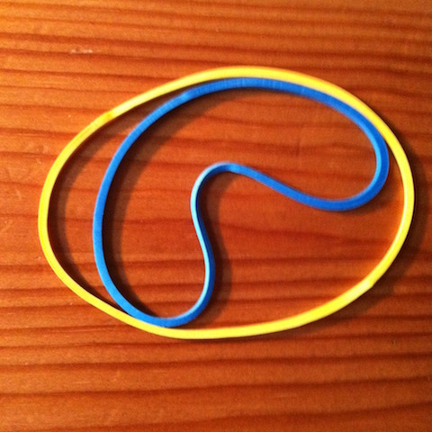
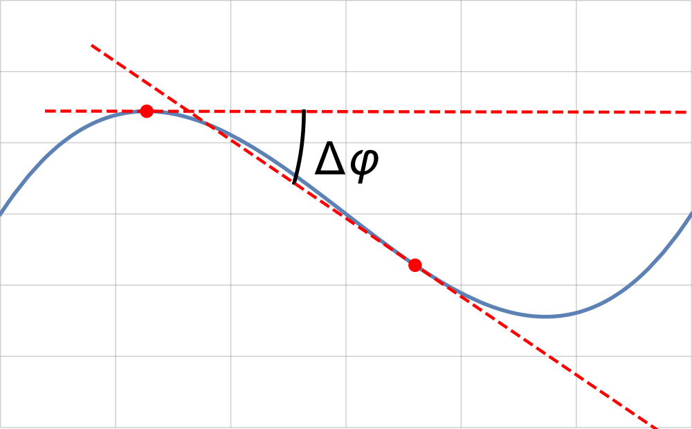
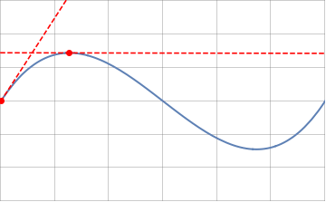
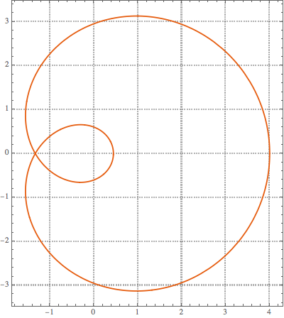
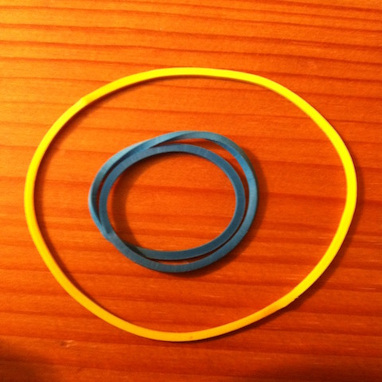

One day I had carried my sandwich to work in a box which I kept shut with two rubber bands. As I was fidgetting with the  bands on the table, I noticed that if I tried to force one inside the other it formed an inward bulge:

I wondered if there were a mathematical explanation to it, and sure enough, there is!

In the language of differential geometry, the curvature of a rubber band can be defined as the instantaneous change in the angle made by the tangent vector to the band and some arbitrary axis (see figure below):

The formal definition is
$$
\begin{equation}
k(s)=\frac{d\phi}{ds}~,
\label{eq:k(s)phi}
\end{equation}
$$
where $s$ is a continuous real parameter varying continuously along the curve. The sign of $k(s)$ changes with the curve's concavity:

An intuitive way to understand the above is to look at the angle $\Delta\phi$ spanning a small element of arc length $\Delta s$. Imagine then that this arc is part of a circle tangent to the curve at the point of interest. By definition that circle has a radius, $R(s)$, which satisfies:
$$
\frac{1}{R(s)}=\lim_{\Delta s\rightarrow 0}\frac{\Delta\phi}{\Delta s}=\frac{d\phi}{ds}.
$$
The curvature at a point is then the inverse of the radius of curvature of the tangent circle at a point.

This definition reveals a very elegant result: the integral of the curvature along a closed curve (the **total curvature**) is:
$$
\oint_\mathcal{\gamma} k(s)ds=\oint_\mathcal{\gamma}\frac{d\phi}{ds}ds=n~2\pi,
$$
where $n$ is an integer counting the number of times the curve winds around itself called the **winding number**.

Let's check this result for a few cases. Eq. $\eqref{eq:k(s)phi}$ is not ideal for that. Let's start instead from the general parametrisaton of a curve in 3d:
$$
\vec{\mathcal{\gamma}}^T=(\gamma^x(\lambda),\gamma^y(\lambda),\gamma^z(\lambda)),
$$
where $\lambda$ is some affine parameter varying continuously and monotonously along the curve. The length element is then:
$$
ds=|\vec{\mathcal{\gamma}}(\lambda)|d\lambda.
$$
Hence the total length of the curve is:
$$
S=\oint_\mathcal{\gamma}ds=\oint_\mathcal{\gamma}|\vec{\mathcal{\gamma}}(\lambda)|d\lambda~.
$$
while the curvature writes:
$$
k(\lambda)=\frac{1}{|\vec{\mathcal{\gamma}}(\lambda)|}\frac{d\phi}{d\lambda}.
$$
This new expression does not alter the formula for the total curvature:
$$
\oint_\mathcal{\gamma} k(s)ds=\int_\mathcal{\gamma}\frac{d\phi}{ds}ds=\int_\mathcal{\gamma}\frac{d\phi}{d\lambda}d\lambda,
$$

Restricting our attention to the 2d plane, we have $\vec{\mathcal{\gamma}}(\lambda)^T=(x(\lambda),y(\lambda))$. We can choose the angle $\phi$ from:
$$
\frac{x'(\lambda)}{\sqrt{x^{\prime 2}+y^{\prime 2}}}=\cos\phi,
$$
$$
\frac{y'(\lambda)}{\sqrt{x^{\prime 2}+y^{\prime 2}}}=\sin\phi.
$$
Then:
$$
\frac{d}{d\lambda}\frac{y'(\lambda)}{\sqrt{x^{\prime 2}+y^{\prime 2}}}=\cos\phi\frac{d\phi}{d\lambda}=k(\lambda)|\vec{\mathcal{\gamma}}(\lambda)|\cos\phi=k(\lambda)x'(\lambda),
$$
so that:
$$
\begin{equation}
k(\lambda)=\frac{y'' x'-y'x''}{(x^{\prime 2}+y^{\prime 2})^{3/2}}.
\label{eq:klambda}
\end{equation}
$$
This is the more practical expression for the curvature that we were looking for. We are now ready to look at a few examples.

The circle
------
We choose $\lambda\equiv\theta$, the polar angle : $\vec{\mathcal{\gamma}}(\theta)^T=(r\cos\theta,r\sin\theta)$. The curvature is a constant and so is the curvature radius, which is simply the radius of the circle :
$$
k(\theta)=\frac{1}{r},
$$
and its integral gives
$$
\int_0^{2\pi}\frac{1}{r}~r~d\theta=2\pi.
$$

The ellipse
------
We can parametrise the ellipse as : $\vec{\mathcal{\gamma}}(\theta)^T=(a\cos\theta,b\sin\theta)$, then:
$$
k(\theta)=\frac{ab}{(b^2\cos^2\theta+a^2\sin^2\theta)},
$$
which integrates to $2\pi$ for all $a$ and $b$, as it should.

The Nyquist curve
------

This example is a bit more complex. The curve winds twice on itself and is parametrised as $\vec{\mathcal{\gamma}}(t)^T=(\text{Re}[\frac{1}{(-\frac{1}{2}+e^{it})^2}],-\text{Im}[\frac{1}{(-\frac{1}{2}+e^{it})^2}])$ and its curvature is
$$
k(t)=-\frac{1}{16} (5-4 \cos (t))^2 (2 \cos (t)-7) \sqrt{-\frac{1}{(4 \cos
   (t)-5)^3}}.
$$
Using this, the total curvature can be computed to be :
$$
\int_0^{2\pi}k(t)dt=4\pi,
$$
as expected for a curve with a winding number $n=2$.

Now that we have convinced ourselves of the validity of Eq. $\eqref{eq:klambda}$, we can understand the reason behind the bulge in the inner rubber band of the first figure.

As the inner rubber band is forced within the contour of the other, its curvature must be bigger on a large portion of the curve (more positive). However, as the total curvature must remain equal to $2\pi$, there must be a region of negative curvature to compensate. Hence the bulge.

As it turns out, there *is* a way of getting one rubber band inside the other without the bulge, you just need to increase the winding number:

