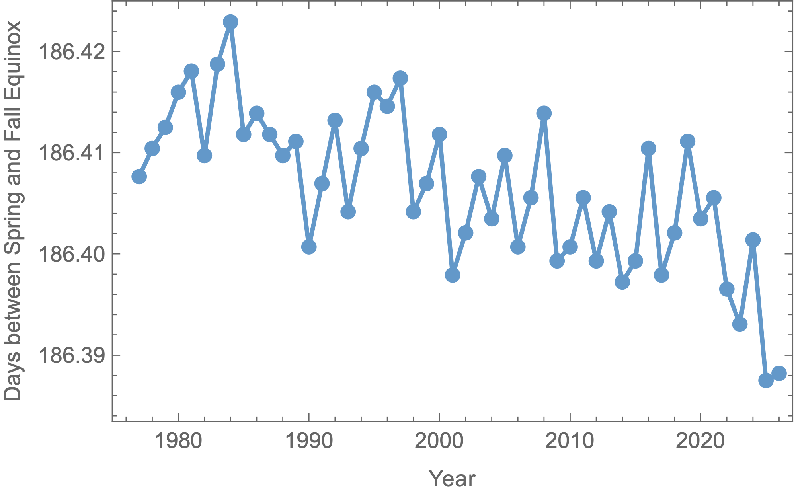
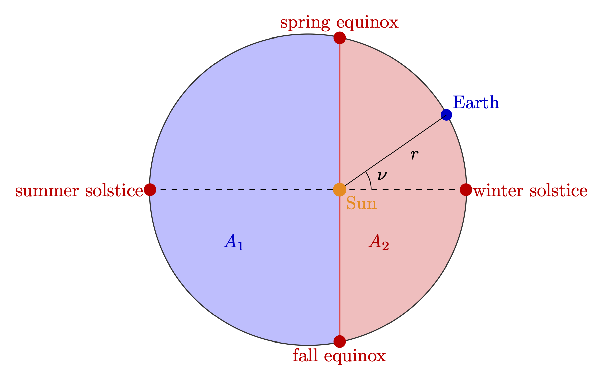
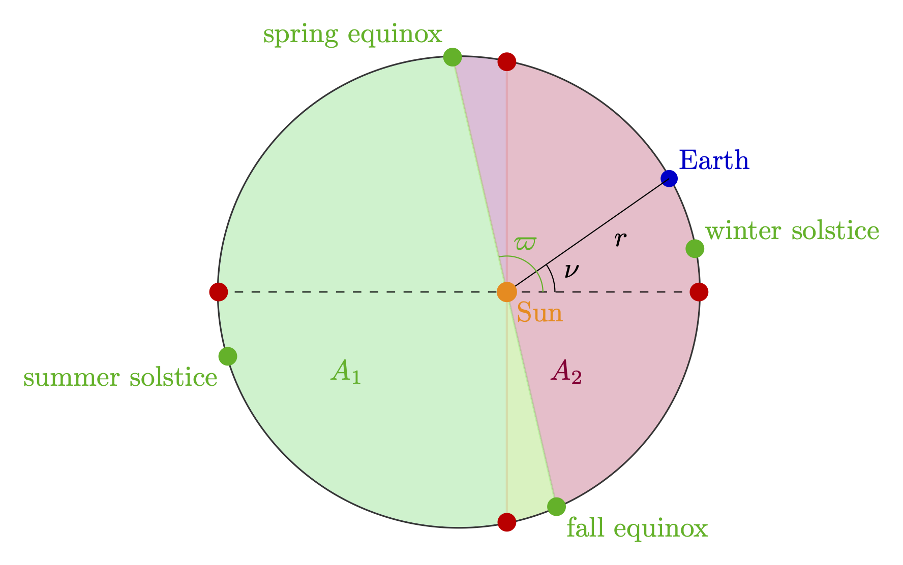

Ever noticed how there are more days between spring and fall than there are between fall and spring? If you do a rough tally of the days between March 21, and September 21 -- the traditional starting dates of spring and fall -- you find 184 days. 

“Ah, but wait!” you say. “Those are approximations of the astronomical spring and fall equinoxes.” That's a sharp observation. But if we pull up the actual dates from a database and compute the intervals, it gets even worse (see figure below).

Don't get me wrong, I *love* the fact that summers are longer than winters in the northern hemisphere, where I live. One thing I also love is astronomy. And it can actually help us solve the mystery, and make us learn a thing or two in the process.

To get started, it helps to draw the orbit of the Earth around the Sun (see the next figure). For simplicity, let's start by assuming that the Earth is closer to the Sun when it is at the winter solstice. This is not exactly true, and we will come back to this later, but it is close enough for the time being. By the way, this is why winters and summers are milder in the Northern hemisphere than in the South. 

The equinoxes correspond to the points of intersection between the Earth's orbit, and the plane going through its equator. The solstices are at midpoints between the equinoxes. The moments when the Earth crosses them is when the Sun appears higher (summer) and lower (winter) in the sky at noon. 

Kepler taught us that the area swept out by the line $r$ connecting the Sun and the Earth between two points in its orbit is proportional to the time the Earth takes to travel between those points. This means that the ratio between the areas $A_2$ and $A_1$ on the figure is equal to the number of days between fall and spring divided by the number of days between spring and fall:
$$
\begin{equation}
\frac{\text{time between fall and spring}}{\text{time between spring and fall}}=\frac{A_2}{A_1}.
\label{eq:ratio}
\end{equation}
$$
It is possible to compute these areas directly from the formula giving the position of the Earth along its orbit:
$$
\begin{equation}
r=\frac{a(1-e^2)}{1+e\cos\nu},
\label{eq:r}
\end{equation}
$$
where $a$ is the *semi-major axis* (dashed line on the figure), and $\nu$ is an angle called the *true anomaly*. The last symbol $e$ is the *eccentricity* of the orbit,
where $a$ is the *semi-major axis* (dashed line on the figure), and $\nu$ is an angle called the *true anomaly*. The last symbol $e$ is the *eccentricity* of the ellipse. When $e=0$ it reduces to a circle. In that limit, it is fairly simple to guess from the figure that the areas would be the same, and therefore also the intervals of time between both equinoxes. To get a more quantitative expression, let's compute the two areas from the dedicated formula in polar coordinates:
$$
A_1=\int_{\pi/2}^{-\pi/2}r^2~d\nu~~~\text{and}~~~A_2=\int_{-\pi/2}^{\pi/2}r^2~d\nu.
$$
Both of these integrals can be evaluated exactly after plugging in Eq.$~\eqref{eq:r}$. In our case, however, it is more than enough to look at the limit of $e\ll1$, in which case the essence of both of these integrals reduces to:
$$
\int\frac{1}{(1+e\cos\nu)^2}~d\nu\approx\int 1-2e\cos\nu~d\nu=\nu-2e\sin\nu+C.
$$
Using this, we finally get the ratio of the two areas:
$$
\begin{equation}
\frac{A_2}{A_1}\approx\frac{\frac{\pi}{2}-2e}{\frac{\pi}{2}+2e}\approx 1-\frac{8e}{\pi},
\label{eq:sol}
\end{equation}
$$
where we have used $e\ll1$ one last time to get to the right-hand side. If we set the value of the ratio $\eqref{eq:ratio}$ equal to $178.84/186.41$, we find $e\approx0.0159$. That is pretty close to the actual value of $e=0.0167$. 

We can get closer to the real value of the eccentricity by returning to our earlier simplification, and by taking into account the actual position of the winter solstice on the Earth's orbit. In reality, the situation is closer to the figure below:

The quantity that matters here, is the angle $\varpi$ called the *longitude of the perihelion* which gives the position of the orbital point closest to the Sun (the perihelion), measured from the spring equinox treated as the direction of reference. Its value is $\varpi\approx103^\circ$. Taking this into account is simple enough, we just need to change the bounds of integration slightly, when computing the new areas $A_1$ and $A_2$:
$$
A_1=\int_{\varpi}^{\varpi+\pi}r^2~d\nu~~~\text{and}~~~A_2=\int_{\varpi-\pi}^{\varpi}r^2~d\nu.
$$
Repeating the rest of the computation gives modifies Eq.$~\eqref{eq:sol}$ into:
$$
\begin{equation}
\frac{A_2}{A_1}\approx 1-\frac{8e\sin\varpi}{\pi}.
\label{eq:solmodif}
\end{equation}
$$
Punching in the numbers gives $e\approx0.0164$, less than $2\%$ error. Not bad. 

The longitude of the perihelion is not constant but changes in time. This is the reason behind the downward trend observable on the first figure and will be the object of a future post.