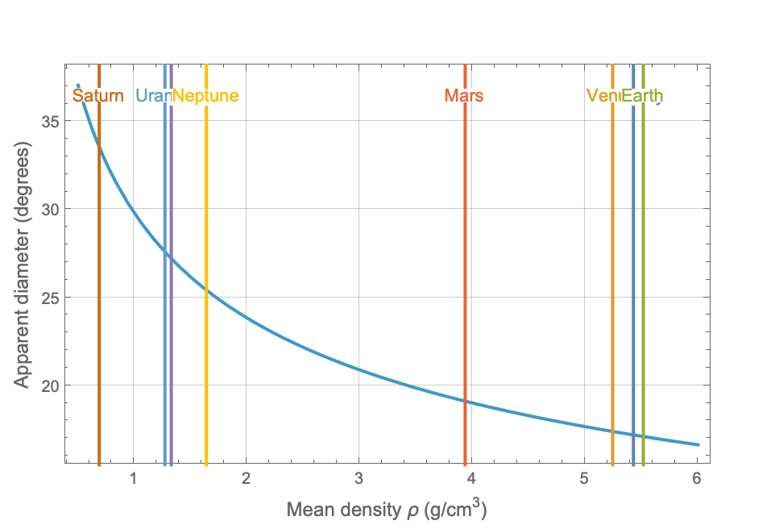
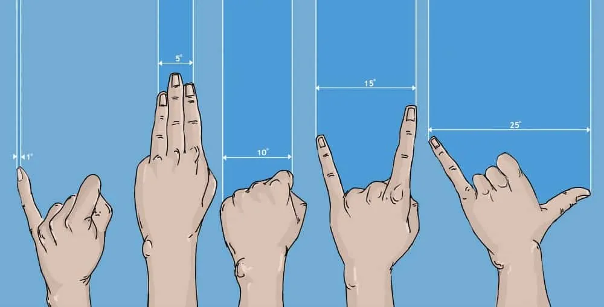

*Theia* is a **fictional** Earth-size moon world in synchronous orbit around its parent planet, *Jove*. In order to reproduce the day-night cycles of the Earth, the Moon’s orbit period is chosen equal to 1 Earth Day. Kepler’s third law related the mean orbital frequency of the moon, $n=2\pi/T$, to the semi-major axis of its orbit and reads (assuming that Jove is much heavier than Theia):
$
\begin{align}
&n^2=\frac{GM}{a^3}\nonumber\\
\leftrightarrow\,&a=R\left(\frac{G}{3\pi}\bar{\rho}\right)^{1/3}T^{2/3},
\end{align}
$
where $\bar{\rho}$ is the mean density of the planet, and $R$ is its radius. 

The synchronous orbit creates an interesting situation where Jove is always visible from one side of Theia’s surface, and never visible from the other side. Its angular diameter in the sky can be shown equal to:
$
\begin{align}
\theta&=2\arctan\left(R/a\right)\nonumber\\
&=2\arctan\left[\left(\frac{3\pi}{G\bar{\rho}T^2}\right)^{1/3}\right].
\end{align}
$
Very interestingly, we see that the apparent size depends only on the planet’s density, and on the orbital period of the moon. Setting the latter to one Earth Day, the following plot gives the angular diameter as a function of the planet’s density. I have added planets of the solar system as vertical lines for reference:

Giant planets are much less dense than terrestrial planets and would therefore appear much larger. But the angular diameter is pretty big in all cases as can be seen from the following figure. This shows a way to visualize the space subtended by various angles by extending your arm between the sky and your eyes:

Earth’s moon looks big, but it only takes up 0.5 degrees in our sky. A planet with Neptune’s density would look 50 times bigger from Theia’s surface. This is a great premise for a fictional world if we can make it habitable. We’ll investigate if it can be done in a future post. 